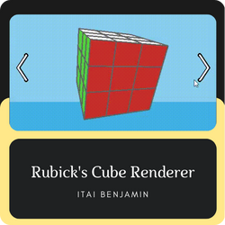

# 👨🏻‍💻 Itai Benjamin

**`Software Engineer Student (ORT Braude College of Engineering)`**

As a Software Engineer student, I am dedicated to improving my skills through hands-on learning, solve real-world problems and gain practical experience. I am a well-organized and collaborative team player with strong communication and analytical abilities. With completed courses in Data Structures and Algorithms, Operating Systems, Databases, and more. Achieving an 82 average with higher grades in programming courses, I am confident in my ability to contribute to any team. I aspire to continuously grow as a professional and be a valuable asset to any organization.

---

### 🧰 Languages and Tools

          
 
 

---

### 💻 Projects

--- 

### 📊 Stats

---

### 📧 Contact Me
          

